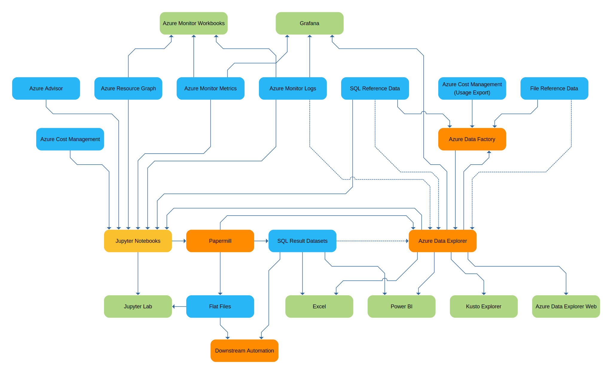
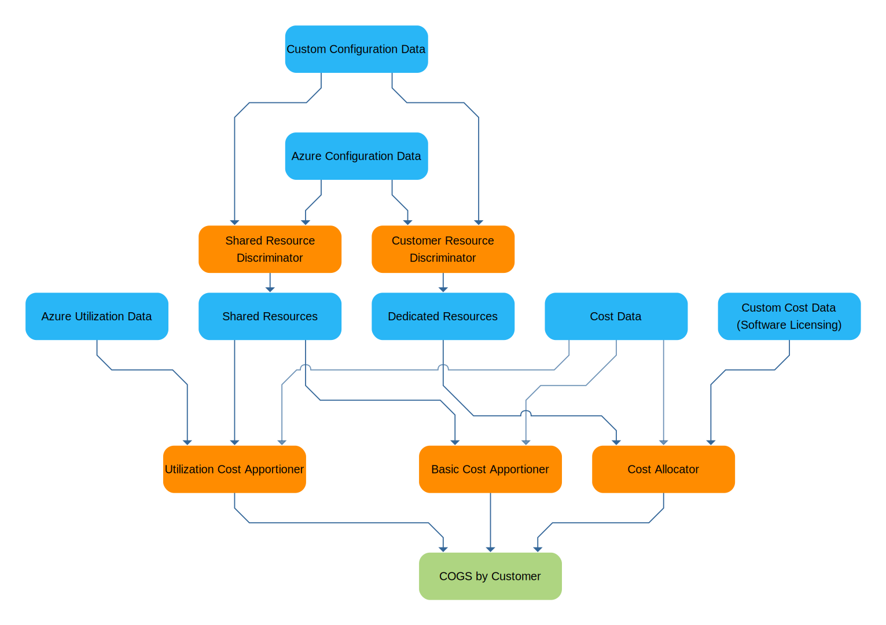

# Azure Metadata Exploration

Azure provides a rich ecosystem of metadata about the operation of Azure itself. The metadata is exposed to you via a variety of modalities. Some data is, or can be, exported to storage (diagnostics, costs), some data is only available via APIs (Azure Monitor Metrics), and some data is available via platform-hosted Kusto (Azure Monitor Logs, Azure Resource Graph). As you scale your use of Azure, you will often find that you need combine the datasets to answer questions about your business built on top of Azure.

Azure Metadata Workflows provides documentation and libraries to make bridging all the modalities easier. It is about enabling you to extract actionable insights specific to your business through any novel combination of this metadata.

Example workflows:

* **Right-sizing** Integrate utilization, recommendations, and price data to reactively allocate resources.
* **Capacity Planning** Use utilization trends to proactively allocate resources or indentify targets for auto-scaling.
* **Cost Analysis** Understand where spend is being allocated at scale. Hunt for savings oppurtunities.
* **Showback** Integrate configuration, utilization, and cost data to allocate and apportion costs back to services and/or customers.

## Data Sources

| Category | Service | Description | Modality |
| --- | --- | --- | --- |
| Configuration | Resource Manager | Actual Azure Resource state. | REST API  |
| Configuration | Policy | Desired Azure Resource state and compliance.| REST API  |
| Configuration | Policy Guest Configuration | Desired VM state and compliance.| REST API |
| Utilization | Monitor Logs | Resource utilization (optional guest-level). | KQL API |
| Utilization | Monitor Metrics | Resource utilization time-series data.| REST API |
| Utilization | [Diagnostics](https://docs.microsoft.com/en-us/azure/azure-monitor/platform/diagnostic-settings) | Detailed resource specific utilization.| Files, Events, KQL API |
| Cost | Cost Management + Billing | Usage (with amortized or actual cost). | Files, REST API
| Cost | Cost Management + Billing | Reservation details and price sheets. | REST API
| Recommendations | Cost Management + Billing | Reservation recommendations. | REST API
| Recommendations | Advisor | Cost, performance recommendations. | REST API
| Custom | *Reference Data* | App or business specific data (i.e. )  | Files, SQL, KQL, REST, etc. |

### Consumption API

* Usage data has 2 modes: Actual vs Amortized.
* Data size ranges from 10s of MiB to 10s of GiB per month depending on the Azure billing account size.
* Not all resources have tags in Cost data.
* Tags are point-in-time.
* No resource group tags information is available.
* Shows restricted vCPU counts.

## Repositories

### Azure Data Explorer

* PaaS Big Data Analysis

## Presentation

* Azure Monitor Workbooks
* Grafana
* Power BI
* Jupyter Lab
* Excel
* Azure Data Explorer Web
* Kusto.Explorer
* Tableau 
* Flat Files (HTML for Presentation)

# Data Flow

# Examples

## Showback

It is valuable to calculate the Cost of Goods Sold on a per customer basis. If a service you provide has a flat-rate cost, consumption of the service could vary by customer, significantly impacting the profitabilty of each customer account.

In this logical flow, configuration, cost, and utilization data is used to calculate the COGS to each customer of the service.

### Discrimination

In this architecture, some Azure resources are shared between all users of the service (i.e. Azure Front Door). Some Azure resources are provisioned on per onboarded customer  (i.e. a SQL MI instance). This step will vary depending upon your resource organization and tagging scheme. If resources are in a separate resource groups identified naming convention or tags it is simple to filter for them in the usage data. In this architecture an auxillary data source is used to lookup customer details based on an ID in a tag. 

### Allocation

The dedicated resources are fed to a cost allocator. This maybe an extremely simple process where a sum is calculated for each customers dedicated resources. In this example auxilary license information is combined with the specs of the dedicated resource (i.e. SQL core count) to calculate and allocate the SQL software licensing used with AHUB.

### Apportionment

Shared resources present a challenge because it can be difficult to know the per customer consumption of the resource.

One or more different methods can be used for apportioning costs of shared resources depending on the resource. In the simplest case the total shared cost for the resource is spread _equally_ across all customers using the service. Depending on the cost of the resource and the difficult to decompose its usage, it may not be worth the effort to use a more advanced method.

A slightly more difficult, but more equitable method is to spread cost of the resource _proportionally_ across all customers using the product using a strong predictive value that is easy to gather. For example, in a multi-tenant SQL database the proportion of records for a customer may correlate well enough with overall usage of the database by that customer. This number is usually not difficult to calculate and is lot better than just equally distributing cost among all the tenants.

In the most advanced case the cost of the resource is _distributed_ across all customers based on their actual utilization of the resource. This may involve diagnostic logs, Azure Monitor Logs, Azure Monitor Metrics, Application Insights, or other application-specific telemetry. For example in this architecture, Azure Front Door is billed on data transfer. Each customer has a subdomain and routing rule in Front Door. The diagnostic logs can be used to account for the data transfer on a per routing rule (and thus customer) basis.

